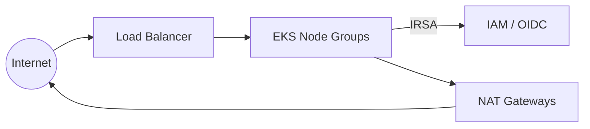

# platform-foundation-aws

Production-ready AWS platform foundation built using Infrastructure as
Code, Platform Engineering, GitOps, and cloud-native engineering best
practices.

This is not a tutorial repository. It is structured the way an internal
platform team would organize and maintain a foundational AWS/Kubernetes
platform, then open-sourced: reusable Terraform modules with real
validation and documentation, honest module status (production-ready vs.
planned), architecture decision records, and CI enforcing the same checks
a platform team would run in production.

## Status

This repository is under active, iterative construction. Sections are
built to completion in order rather than scaffolded everywhere at once.
See [Roadmap](#roadmap) for the order. Nothing below is marked done
unless it actually is.

## Project Overview

The goal is a minimal, opinionated set of production modules: networking
(`vpc`), identity (`iam`), and compute (`eks`), that compose into a real
AWS platform foundation, plus the surrounding engineering practice (CI,
ADRs, documentation, standards) that makes modules like this safe to
depend on in production.

Everything else that a full platform eventually needs (DNS, secrets,
observability, WAF, messaging) is scoped as **Planned**: interface and
documentation only, no fabricated implementation. See
[Module Status](#module-status).

## Architecture



This is the short version. Full diagrams (Mermaid, rendered inline on
GitHub) live in [`architecture/`](architecture):

- [High-Level Platform Architecture](architecture/high-level-platform-architecture.md)
- [AWS Networking](architecture/aws-networking.md)
- [Terraform Module Relationships](architecture/terraform-module-relationships.md)
- [Environment Layout](architecture/environment-layout.md)
- [Deployment Flow](architecture/deployment-flow.md)

These describe the target design the `vpc`/`iam`/`eks` modules are being
built to match (Milestones 4-6). See [Roadmap](#roadmap) for what's
implemented versus documented ahead of implementation right now.

## Documentation

| Doc | Covers |
| --- | --- |
| [docs/architecture.md](docs/architecture.md) | How modules/environments/workloads layer together |
| [docs/networking.md](docs/networking.md) | VPC subnet tiers, CIDR sizing, NAT strategy |
| [docs/terraform-standards.md](docs/terraform-standards.md) | Module structure, naming, validation, versioning |
| [docs/security.md](docs/security.md) | IRSA, least privilege, encryption, secrets, state security |
| [docs/gitops.md](docs/gitops.md) | What GitOps-ready means here, and what's not shipped |
| [docs/cost-optimization.md](docs/cost-optimization.md) | NAT/node group/logging cost levers |
| [docs/repository-standards.md](docs/repository-standards.md) | Branching, versioning, tagging, review process |
| [docs/operational-guidelines.md](docs/operational-guidelines.md) | Safe apply, drift, rollback |
| [docs/adr/](docs/adr) | Architecture Decision Records: the trade-offs behind the big calls |

## Key Features

- Reusable Terraform modules with variable validation, production naming
  conventions, and documented design trade-offs, not copy-pasted example
  code.
- IRSA-first IAM design: no static node-level credentials for controllers
  that can assume a scoped role instead.
- CI that mirrors what a platform team actually gates on: `terraform fmt`,
  `terraform validate`, `tflint`, `tfsec`, `checkov`, `markdownlint`.
- Architecture Decision Records for the decisions that matter (Terraform
  vs. alternatives, EKS vs. self-managed, GitOps, IRSA, multi-AZ
  networking), including the trade-offs, not just the conclusion.
- Explicit, honest module status. A module is either production-ready or
  it's marked Planned. There is no in-between state pretending to be
  done.

## Repository Structure

```text
.
├── .github/              GitHub Actions workflows, issue/PR templates, Dependabot
├── architecture/         Mermaid architecture diagrams
├── assets/               Static images referenced from docs
├── docs/                 Engineering documentation (standards, security, gitops, ...)
│   └── adr/              Architecture Decision Records
├── environments/         Deployable stacks composing modules (dev/staging/prod)
├── examples/             Reference compositions of the production modules
├── modules/               Reusable Terraform modules (production-ready + planned)
├── scripts/              Operational helper scripts
├── terraform/            Reserved for shared root-level Terraform config
├── CHANGELOG.md
├── CODEOWNERS
├── CODE_OF_CONDUCT.md
├── CONTRIBUTING.md
├── LICENSE
├── README.md
└── SECURITY.md
```

## Technology Stack

| Layer | Choice |
| --- | --- |
| IaC | Terraform |
| Cloud | AWS |
| Container orchestration | Amazon EKS (Kubernetes) |
| Identity | IAM Roles for Service Accounts (IRSA), OIDC |
| CI | GitHub Actions |
| Static analysis | tflint, tfsec, checkov |
| Documentation | Markdown + Mermaid, Architecture Decision Records |

## Engineering Principles

- **Infrastructure as Code**: every resource is defined in Terraform.
  Nothing is click-ops'd and then documented after the fact.
- **Security by default**: least-privilege IAM, IRSA over static
  credentials, encryption defaults, security groups scoped to what the
  module actually needs.
- **Automation first**: CI enforces formatting, validation, and security
  scanning on every change. It's not left to reviewer memory.
- **Documentation as code**: module READMEs, ADRs, and standards docs are
  reviewed the same way code is, and are expected to stay in sync with
  what's actually deployed.
- **Production first, not portfolio-first**: the bar for "done" is
  "would I trust this in a real account," not "does it demo well."

## Module Status

Status reflects what's actually in `modules/` right now, not the end
state. See [Roadmap](#roadmap) for sequencing.

### Production-Ready

| Module | Description |
| --- | --- |
| [`vpc`](modules/vpc) | Multi-AZ VPC: public/private/database subnets, configurable NAT strategy, per-AZ route tables, NACLs, locked-down default security group, EKS subnet tagging |
| [`iam`](modules/iam) | IAM OIDC provider, generic IRSA role pattern, built-in examples for External DNS, AWS Load Balancer Controller, Cluster Autoscaler |
| [`eks`](modules/eks) | Managed node groups, cluster/node IAM roles, production security groups, control plane logging, EKS addons, Access Entry-based access, OIDC issuer for IRSA |

All three foundation modules (`vpc`, `iam`, `eks`) are now implemented.
See [Roadmap](#roadmap) for what's next (`examples/`/`environments/`
wiring them together).

### Planned

Interface and documentation only, no implementation yet.

| Module | Purpose |
| --- | --- |
| [`acm`](modules/acm) | TLS certificate provisioning |
| [`route53`](modules/route53) | DNS zone and record management |
| [`secrets-manager`](modules/secrets-manager) | Application secret storage |
| [`cloudwatch`](modules/cloudwatch) | Centralized logging and alarms |
| [`kms`](modules/kms) | Customer-managed encryption keys |
| [`s3-remote-state`](modules/s3-remote-state) | Terraform remote state backend |
| [`ecr`](modules/ecr) | Container image registry |
| [`waf`](modules/waf) | Edge/application layer protection |
| [`eventbridge`](modules/eventbridge) | Event routing |
| [`sns`](modules/sns) | Pub/sub notifications |
| [`sqs`](modules/sqs) | Queue-based decoupling |

Karpenter is intentionally out of scope for this repository. It's
planned as its own future repository rather than a module bolted onto
this one. See the `eks` module README for the reasoning once that module
exists.

## How to Use

Not yet applicable. The `vpc`, `iam`, and `eks` modules and the
`examples/` compositions that demonstrate using them together are still
being built. This section will include real `terraform init/plan/apply`
usage once there's something real to run.

## Development Workflow

See [CONTRIBUTING.md](CONTRIBUTING.md) for branching, commit conventions,
and required local checks. In short:

```bash
terraform fmt -recursive
terraform validate
tflint --recursive
tfsec .
checkov -d .
```

All of the above also run in CI on every pull request.

## Roadmap

Built in this order, each finished before the next starts. See
[Module Status](#module-status) for current progress rather than
treating this list as a live checklist.

1. Repository scaffolding & governance
2. CI/CD (GitHub Actions)
3. Documentation set (standards, ADRs, architecture diagrams)
4. `vpc` module
5. `iam` module
6. `eks` module
7. Planned module interfaces (ACM, Route53, Secrets Manager, CloudWatch,
   KMS, S3 remote state, ECR, WAF, EventBridge, SNS, SQS)
8. `examples/` and `environments/` wiring the production modules together
9. Final README pass with architecture diagrams and complete status table

## Contributing

See [CONTRIBUTING.md](CONTRIBUTING.md). Security issues should go through
[SECURITY.md](SECURITY.md), not public issues.

## License

[MIT](LICENSE)
