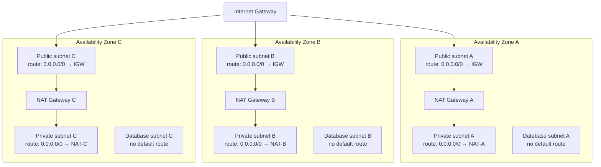

# AWS Networking

The subnet tiers and route table boundaries the `vpc` module implements.
See [ADR-005](../docs/adr/ADR-005-why-multi-az-networking.md) for why
three tiers across three AZs is the default rather than a cost-driven
single-AZ shortcut.

## Reading this diagram

- **Public subnets** hold NAT gateways and (when a workload needs one) an
  internet-facing load balancer. Route: default route to the Internet
  Gateway.
- **Private subnets** host EKS node groups. Route: default route to the
  NAT gateway *in the same AZ*, not a shared cross-AZ NAT, so a single
  AZ's NAT failure doesn't take down another AZ's egress path. This is
  the production default; `single_nat_gateway = true` collapses this to
  one shared NAT for cost-constrained non-prod environments (see
  [cost-optimization.md](../docs/cost-optimization.md)).
- **Database subnets** have no default route to either the IGW or a NAT
  gateway at all. Reaching them requires being inside the VPC (or using a
  VPC endpoint for AWS-managed services). This is deliberate isolation,
  not a gap to fill in later.
- Subnets are tagged for Kubernetes/ALB auto-discovery
  (`kubernetes.io/role/elb`, `kubernetes.io/role/internal-elb`,
  `kubernetes.io/cluster/<name>`). See the `vpc` module README for the
  exact tag set once that module ships.
