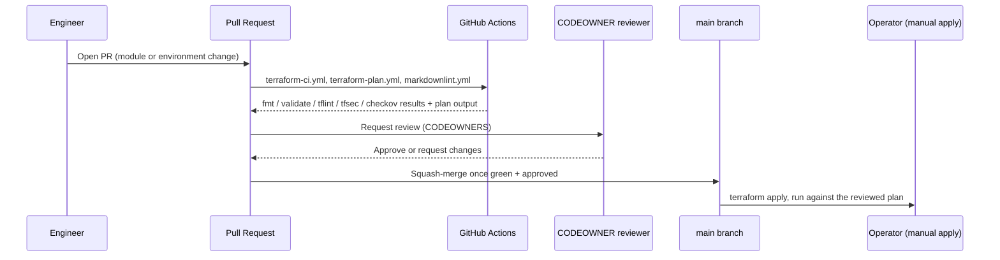

# Deployment Flow

The path from a code change to an applied Terraform change. `apply` is
deliberately a manual, human-triggered step in this design, not something
that runs automatically on merge. See the note below.

## Reading this diagram

- CI never runs `terraform apply`. It runs everything that's safe to run
  unattended against a pull request (formatting, validation, linting,
  security scanning, and, once `environments/` exists, a `plan`), but
  applying infrastructure changes stays a deliberate, attributable action
  a person takes, not a side effect of a merge button. For a repository
  whose blast radius includes IAM policies and network topology, that's
  a trade-off worth making explicitly rather than defaulting into
  auto-apply for convenience.
- The reviewer's job is to read the **plan**, not just the diff. A
  one-line variable change can produce a plan that replaces a subnet.
  `docs/security.md` and `docs/repository-standards.md` describe what a
  reviewer is expected to scrutinize versus what CI already caught.
- This flow applies identically whether the change is to a `modules/*`
  module or an `environments/*` stack. The only difference is which
  workflow's matrix picks it up (`terraform-ci.yml` for modules in
  isolation, `terraform-plan.yml` for environments with real backend
  state).
