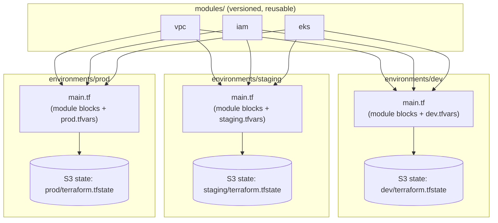

# Environment Layout

How `environments/` is intended to compose the modules in `modules/` once
that milestone ships. Each environment is an independent Terraform root
with its own state, own variable values, and its own blast radius.

## Reading this diagram

- Each environment is a **separate Terraform root module** with its own
  state file and its own remote-state key. A mistake or blast radius in
  `dev` cannot corrupt `prod` state, because there is no shared state to
  corrupt.
- Environments consume the *same* module source (`modules/vpc`,
  `modules/iam`, `modules/eks`), pinned to the same or deliberately
  different version depending on rollout stage. This is what makes "the
  module works in dev" a meaningful signal for staging/prod, rather than
  three independently-drifted copies of similar Terraform.
- What differs between environments is `.tfvars`: instance sizes, NAT
  strategy (`single_nat_gateway = true` in dev, `false` in prod, see
  [ADR-005](../docs/adr/ADR-005-why-multi-az-networking.md)), node group
  scaling bounds, and tags.
- This layout doesn't exist yet. `environments/` currently only has a
  placeholder README. It's documented here because the module design
  (milestones 4-6) is being built to fit this shape, not the other way
  around.
