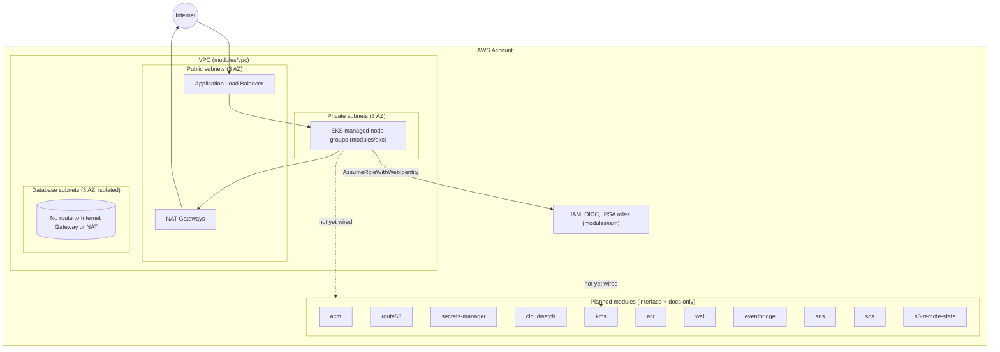

# High-Level Platform Architecture

What exists today (`vpc`, `iam`, `eks`) versus what's designed for but not
yet implemented (everything under "Planned"). The dotted edges are
intentional: they mark where a real integration will be wired once those
modules move from interface to implementation.

## Reading this diagram

- **Solid edges** are real: the `vpc` module's public subnets host NAT
  gateways and (eventually) an ALB; the `eks` module's node groups run in
  private subnets; pods assume IAM roles via IRSA, not the node role
  directly (see [ADR-004](../docs/adr/ADR-004-why-irsa.md)).
- **Dotted edges** mark integrations that make architectural sense but
  aren't implemented, for example Secrets Manager for application
  secrets, CloudWatch for centralized logging beyond what the `eks`
  module emits on its own, and KMS for customer-managed encryption keys
  IAM policies would reference. These stay dotted until the
  corresponding module ships.
- Karpenter is deliberately absent from this diagram. See
  [ADR-002](../docs/adr/ADR-002-why-amazon-eks.md) for why it's scoped as
  a future, separate repository instead of a box here.
