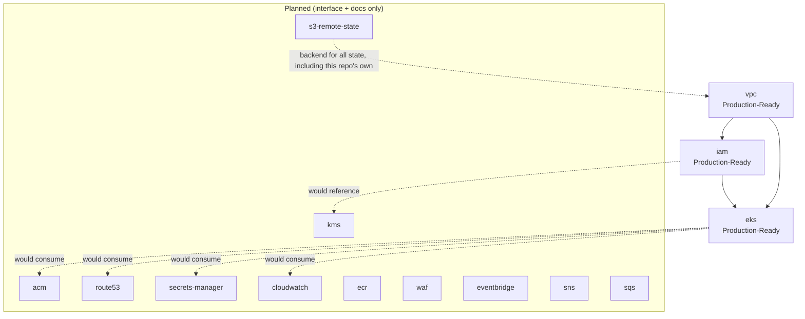

# Terraform Module Relationships

Which modules consume which, and where the Production-Ready / Planned
boundary sits. This is the dependency graph an `environments/*` stack
composes. See [environment-layout.md](environment-layout.md) for how
that composition actually happens per environment.

## Reading this diagram

- `vpc` has no dependencies on other modules in this repository. It's
  the foundation everything else consumes.
- `iam` depends on `vpc` only for the EKS OIDC provider association (once
  a cluster exists); its IRSA role definitions themselves are
  cluster-agnostic.
- `eks` consumes both `vpc` (subnets, security groups) and `iam` (node
  role, IRSA roles for cluster add-ons).
- Every edge into `PlannedModules` is dotted because nothing consumes
  them yet. They're documented interfaces, not wired dependencies. When
  `acm` ships, for example, the edge from `eks` (or more likely an
  ingress/ALB configuration in `examples/`) becomes solid.
- `s3-remote-state` is architecturally "underneath" every other module
  (it's what backs their state files), which is why it's drawn as a
  foundation concern rather than a peer of `acm`/`route53`/etc. It's
  still Planned, though, so this repository's own modules don't yet
  assume a remote backend exists.
